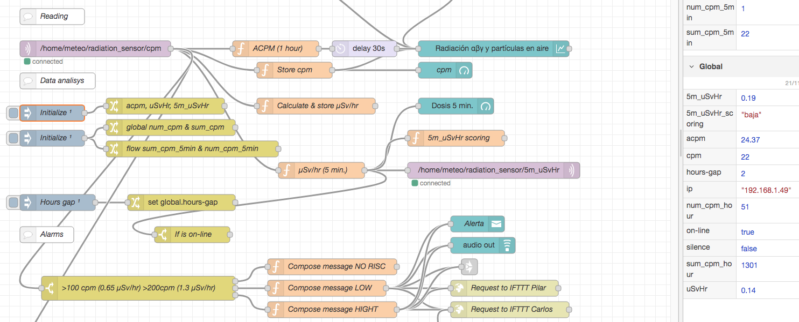

#  Taller sensor IoT de radiactividad
Taller IoT para construir un medidor Geiger conectado. Basado en el ESP8266, MQTT, Node-RED e integrado en la red GMC

## Componentes que vamos a utilizar
**Hardware**
- [ ] 1 x [WEMOS D1 Mini Pro 16 MBytes con antena externa](https://www.aliexpress.com/item/32801063577.html)


La placa de prototipo Wemos D1 Mini es microcontrolador muy versatil y de tamaño reducido.
  - Permite ser programado directamente desde el IDE de Arduino.
  - Ofrece pines de voltajes de salida de 3,2V y 5V.
<br>
  - Tiene conectividad Wi-Fi con todo el estak de TCP/IP.
<br>
  - Incluye el chip CP2104 USB-TO-UART IC
<br>
  - El microcontrolador incorporado es el ESP-8266EX
<br>
    _  * Con un voltaje de funcionamiento: 3,3 V (chip) 5 V (placa)
<br>
    _  * Tiene 11 pines de E/S digitales: de los cuales 2 son serie y otros 2 para I2C
<br>
    _  * Pines de entrada analógica: 1 (entrada máxima: 3,2 V)
<br>
    _  * 16M bytes(128M bit) Flash
<br>

- [ ] 1 x [Contador Geiger radiación Beta Gamma ensamblado](https://es.aliexpress.com/item/1005004074447194.html)


- [ ] 1 x [Convertidor DC-DC, 12V a 5V conector micro-USB](https://es.aliexpress.com/item/32973455778.html)


- [ ] 1 x [Caja impermeable para exteriores con tapa transparente de plástico ABS](https://es.aliexpress.com/item/4000852737997.html)


- [ ] 1 x [Placa protoboard para soldar](https://es.aliexpress.com/item/4001094817386.html)


- [ ] 1 x [Cable apantallado de al menos tres hilos](https://es.aliexpress.com/item/1005004134473331.html)


- [ ] 1 x [Conector para soldar en PCB](https://es.aliexpress.com/item/33025312329.html)


- [ ] 1 x [Resistencia ajustable de 10 Kohm](https://es.aliexpress.com/item/33043479672.html)


- [ ] 1 x [conector dos pines IP68](https://es.aliexpress.com/item/4000058485279.html)


## Montaje
La idea es cocolar y conectar todos los componentes dentro de la caja de 125x125mm de tapa transparente. Aunque el tubo Geiger irá fuera a efectos de que la caja no haga de aislamiento de la radiación alfa (α).

La conectividad es bastante sencilla aunque hay que asegurarse de una buena conexión y aislamiento ya que el dispositivo trabaja a 380V.


- Lo primero será cablear la PCB según el esquema anterior.


- Si queremos que el sensor tenga un largo alcance de conexión. Es necesario activar la salida de antena WiFi del **microcontrolador Wemos D1 mini**. Para ello hay que recolocar una resistencia de 0 ohm. Es un componente SMD por lo tanto pequeño y dificil de manejar. Hay que desoldarlo y vlverlo a soldar con un giro de 90º


- La placa del circuito principal del sensor se fijará al fondo de la caja con dos tornillos centrales. Tras lo que tendremos a la vista el espacio para colocar el **conector de alimentación** en la parte superior derecha. Si vamos alimentar el circuito con 12V dendremos que soldar la entrada del adaptador a la parte interna de este conector.


- Por otra parte vamos a preparar el **tubo Geiger** para que quede en el exterior de manera que sea más sensible a la radiación Alfa. Para ello utilizaremos dos cables gruesos, de diferentes colores para mantener la referencia de la polaridad. Estos cables van soldados directamente al tubo y a un casquillo de fusible en el otro extremo.
<br>
Nos aseguraremos de aislar bien todas las partes donde el conector del tubo haya quedado expuesto al aire. El tubo se alimenta de 380V que es una tensión peligrosa.


- La **antena Wifi** se podrá situar fácilmente en la esquina superior derecha de la caja:


- Antes de fijar la placa transpatente que soporta la PCB, conectaremos el cable de tres hilos.


## Software
### 1. Instalación del IDE de Arduino (Ver 2.0.1)
Puedes descargar la última versión del IDE de Arduino desde [este sitio web](https://www.arduino.cc/en/software) si aún no la tienes.

Los sistemas Mac y Windows tienen opciones de instalación típicas. Los usuarios de Linux pueden beneficiarse de [esta información adicional](https://docs.arduino.cc/software/ide-v1/tutorials/Linux) en el sitio web de Arduino.

### 2. Añadir la placa ESP en el manager
Una vez que se haya instalado el IDE de Arduino, ábralo y haga clic en preferencias .
 

Tendremos que agregar esta  URL em la caja de texto de "Additional board manager URLs":
```
https://arduino.esp8266.com/stable/package_esp8266com_index.json
```
Si ya hay URL registradas se puede hacer clic en el ícono pequeño a la derecha del cuadro de texto para registrar varias URL's.

### 3. Añadir las placas ESP para el configurador
Ahora podemos agregar los tableros ESP haciendo clic en la opción herramientas > tablero > administrador de tableros… en el menú.
 

Busca el paquete ESP8266 e instálalo. Una vez que se haya instalado, puedes cerrar el administrador de placas.

### 4. Elige la placa y el puerto
A continuación, debemos seleccionar la placa Wemos D1 Mini PRO del menú de herramientas. Tendremos que seleccionar **LOLIN (WEMOS) D1 mini PRO** de los dispositivos ESP recién agregados.
 

Puede suceder que la aplicación encuentre dependencias u otras librerias desactializadas. Aparecería un mensaje como este que deberás aceptar.
 

Finalmente, debemos elegir el puerto correcto en el menú de herramientas . En Mac/Linux esto aparecerá como algo así como **dev/cu.usbserial-xxxx** y en Windows será **COMX\**.
 

### 5. _Testing Point_
En este punto vamos a chequear todo cargando un _sketch_ que hará que la luz azul de la placa parpadee.
Este programa lo podrás encontrar en la ruta de ejemplos:
 

### 6. Añadir la librería de MQTT
Nuestro sensor va a utilizar colas MQTT para publicar sus lecturas y recbir comandos. Esta es la razón por la que hay la llamada a esta librería: 
#include <PubSubClient.h>

Por lo tanto hay se buscarla e instalarla con todas sus dependencias:
 

### 7. Configuración y carga del firmware 
El programa incluye un archivo de configuración _settings.h_ que contiene las credenciales para la conexión WiFi que hay que poner, y la configuración MQTT de nuestro servidor o de uno externo.

```cpp
// WiFi Configuration
const char* ssid = "??";
const char* password = "??";

// MQTT Configuration
const char* mqtt_server = "192.168.1.114";
const int mqtt_port = 1883;
const char* mqtt_id = "radiation_sensor";
const char* mqtt_sub_topic_healthcheck = "/home/meteo/radiation_sensor";
const char* mqtt_sub_topic_ip = "/home/meteo/radiation_sensor/ip";
const char* mqtt_sub_topic_operation = "/home/meteo/radiation_sensor/operation";
const char* mqtt_pub_topic_radiation = "/home/meteo/radiation_sensor/cpm";

// Other params
const int pin_detector = 14; //D5
```

Con todo lo anterior configurado ahora solo tendrás que abrir [el programa](./src/IoT_nuclear_radiation_sensor/IoT_nuclear_radiation_sensor.ino) y dar al botón de cargar (_upload_) y al cabo de un rato, el firmaware nuevo se cargará en la placa empezando a parpadear el LED y con estos mensajes de salida en la aplicación:
 

## Registrar el dispositivo
Vamos a utilizar la plataforma de GMC.MAP que está desarrollada por un fabricante GQ Electronics LLC y que amablemente ha abierto a la comunidad para que podamos integrar nuestros sensores en su GIS.

### Crea una cuenta


El registro del dispositivo se hace desde la web https://www.gmcmap.com/userAccountLogin-x.asp

### Añade el dispositivo


Una vez creas una cuenta e inicias sesión, podrás registrar tu dispositivo. Completa el formulario para registrar tu dispositivo. Ve a Inicio -> (Iniciar sesión) - Sensores -> Registrar nuevo sensor

-   El ID del sensor es el ChipID del ESP8266 (NodeMCU) que anotaste antes
-   Tu dirección de correo electrónico no será publicada
-   Tu dirección: Calle con número de casa, código postal y ciudad. Haga clic en "Buscar dirección ingresada" para obtener las coordenadas de la ubicación. Compruebe la posición, cámbielo si es necesario
-   Establece un nombre de sensor personal para que sea más fácil separarlos si tienes varios sensores (como jardín, etc.)
-   Los alrededores de la estación (Ejemplo: altura sobre el suelo, lado de la carretera, alto volumen de tráfico, campo libre o similar)

## Integración con Node-RED



Como hemos visto en la configuración del firmware del microcontrolador tenemos un servidor MQTT al que se enviará la información. Si visualizamos directamente el topic donde llevan los valores, veremos esto:


