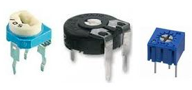
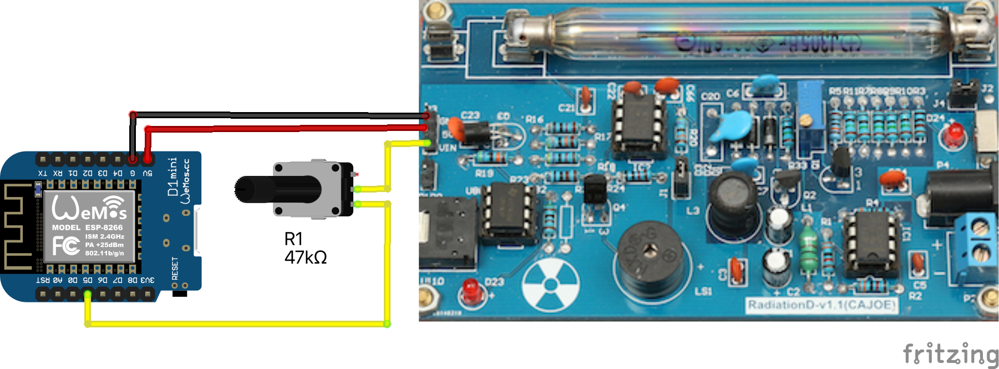
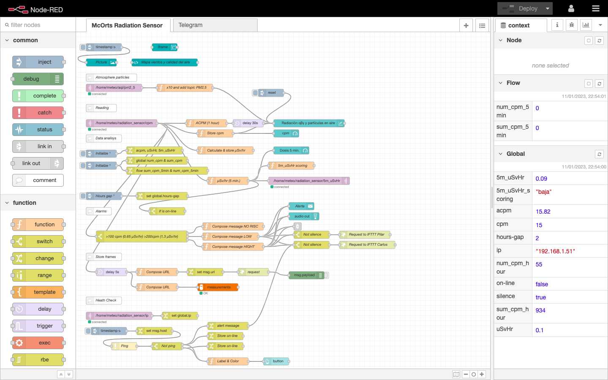

#  Taller sensor IoT de radiactividad
Taller IoT para construir un medidor Geiger conectado. Basado en el ESP8266, MQTT, Node-RED e integrado en la red GMC

## Componentes que vamos a utilizar
**Hardware**
- [ ] 1 x [WEMOS D1 Mini Pro 16 MBytes con antena externa](https://www.aliexpress.com/item/32801063577.html)


La placa de prototipo Wemos D1 Mini es microcontrolador muy versátil y de tamaño reducido.
  - Permite ser programado directamente desde el IDE de Arduino.
  - Ofrece pines de voltajes de salida de 3,2V y 5V.
<br>
  - Tiene conectividad Wi-Fi con todo el _stack_ de TCP/IP.
<br>
  - Incluye el chip CP2104 USB-TO-UART IC
<br>
  - El microcontrolador incorporado es el ESP-8266EX
<br>
    _  * Con un voltaje de funcionamiento: 3,3 V (chip) 5 V (placa)
<br>
    _  * Tiene 11 pines de E/S digitales: de los cuales 2 son serie y otros 2 para I2C
<br>
    _  * Pines de entrada analógica: 1 (entrada máxima: 3,2 V)
<br>
    _  * 16M bytes(128M bit) Flash
<br>

- [ ] 1 x [Contador Geiger radiación Beta Gamma ensamblado](https://es.aliexpress.com/item/1005004074447194.html)


- [ ] 1 x [Convertidor DC-DC, 12V a 5V conector micro-USB](https://es.aliexpress.com/item/32973455778.html)


- [ ] 1 x [Caja impermeable para exteriores con tapa transparente de plástico ABS](https://es.aliexpress.com/item/4000852737997.html)


- [ ] 1 x [Placa protoboard para soldar](https://es.aliexpress.com/item/4001094817386.html)


- [ ] 1 x [Cable apantallado de al menos tres hilos](https://es.aliexpress.com/item/1005004134473331.html)


- [ ] 1 x [Conector para soldar en PCB](https://es.aliexpress.com/item/33025312329.html)


- [ ] 1 x [Resistencia ajustable de 10 Kohm](https://es.aliexpress.com/item/33043479672.html)


- [ ] 1 x [conector dos pines IP68](https://es.aliexpress.com/item/4000058485279.html)


## Montaje
La idea es colocar y conectar todos los componentes dentro de la caja de 125x125mm de tapa transparente. Aunque el tubo Geiger irá fuera a efectos de que la caja no haga de aislamiento de la radiación alfa (α).

La conectividad es bastante sencilla aunque hay que asegurarse de una buena conexión y aislamiento ya que el dispositivo trabaja a 380V.


- Lo primero será cablear la PCB según el esquema anterior.


- Si queremos que el sensor tenga un largo alcance de conexión. Es necesario activar la salida de antena WiFi del **microcontrolador Wemos D1 mini**. Para ello hay que recolocar una resistencia de 0 ohm. Es un componente SMD por lo tanto pequeño y dificil de manejar. Hay que des-soldarlo y volver a soldar con un giro de 90º


- La placa del circuito principal del sensor se fijará al fondo de la caja con dos tornillos centrales. Tras lo que tendremos a la vista el espacio para colocar el **conector de alimentación** en la parte superior derecha. Si vamos alimentar el circuito con 12V tendremos que soldar la entrada del adaptador a la parte interna de este conector.


- Por otra parte vamos a preparar el **tubo Geiger** para que quede en el exterior de manera que sea más sensible a la radiación Alfa. Para ello utilizaremos dos cables gruesos, de diferentes colores para mantener la referencia de la polaridad. Estos cables van soldados directamente al tubo y a un casquillo de fusible en el otro extremo.
<br>
Nos aseguraremos de aislar bien todas las partes donde el conector del tubo haya quedado expuesto al aire. El tubo se alimenta de 380V que es una tensión peligrosa.


- La **antena Wifi** se podrá situar fácilmente en la esquina superior derecha de la caja:


- Antes de fijar la placa transparente que soporta la PCB, conectaremos el cable de tres hilos.


## Software
### 1. Instalación del IDE de Arduino (Ver 2.0.1)
Puedes descargar la última versión del IDE de Arduino desde [este sitio web](https://www.arduino.cc/en/software) si aún no la tienes.

Los sistemas Mac y Windows tienen opciones de instalación típicas. Los usuarios de Linux pueden beneficiarse de [esta información adicional](https://docs.arduino.cc/software/ide-v1/tutorials/Linux) en el sitio web de Arduino.

### 2. Añadir la placa ESP en el manager
Una vez que se haya instalado el IDE de Arduino, ábralo y haga clic en preferencias .
 

Tendremos que agregar esta  URL em la caja de texto de "Additional board manager URLs":
```
https://arduino.esp8266.com/stable/package_esp8266com_index.json
```
Si ya hay URL registradas se puede hacer clic en el ícono pequeño a la derecha del cuadro de texto para registrar varias URL's.

### 3. Añadir las placas ESP para el configurador
Ahora podemos agregar los tableros ESP haciendo clic en la opción herramientas > tablero > administrador de tableros… en el menú.
 

Busca el paquete ESP8266 e instálalo. Una vez que se haya instalado, puedes cerrar el administrador de placas.

### 4. Elige la placa y el puerto
A continuación, debemos seleccionar la placa Wemos D1 Mini PRO del menú de herramientas. Tendremos que seleccionar **LOLIN (WEMOS) D1 mini PRO** de los dispositivos ESP recién agregados.
 

Puede suceder que la aplicación encuentre dependencias u otras librerías des-actializadas. Aparecería un mensaje como este que deberás aceptar.
 

Finalmente, debemos elegir el puerto correcto en el menú de herramientas . En Mac/Linux esto aparecerá como algo así como **dev/cu.usbserial-xxxx** y en Windows será **COMX\**.
 

### 5. _Testing Point_
En este punto vamos a chequear todo cargando un _sketch_ que hará que la luz azul de la placa parpadee.
Este programa lo podrás encontrar en la ruta de ejemplos:
 

### 6. Añadir la librería de MQTT
Nuestro sensor va a utilizar colas MQTT para publicar sus lecturas y recbir comandos. Esta es la razón por la que hay la llamada a esta librería: 
#include <PubSubClient.h>

Por lo tanto hay se buscarla e instalarla con todas sus dependencias:
 

### 7. Configuración y carga del firmware 
El programa incluye un archivo de configuración _settings.h_ que contiene las credenciales para la conexión WiFi que hay que poner, y la configuración MQTT de nuestro servidor o de uno externo.

```cpp
// WiFi Configuration
const char* ssid = "??";
const char* password = "??";

// MQTT Configuration
const char* mqtt_server = "192.168.1.114";
const int mqtt_port = 1883;
const char* mqtt_id = "radiation_sensor";
const char* mqtt_sub_topic_healthcheck = "/home/meteo/radiation_sensor";
const char* mqtt_sub_topic_ip = "/home/meteo/radiation_sensor/ip";
const char* mqtt_sub_topic_operation = "/home/meteo/radiation_sensor/operation";
const char* mqtt_pub_topic_radiation = "/home/meteo/radiation_sensor/cpm";

// Other params
const int pin_detector = 14; //D5
```

Con todo lo anterior configurado ahora solo tendrás que abrir [el programa](./src/IoT_nuclear_radiation_sensor/IoT_nuclear_radiation_sensor.ino) y dar al botón de cargar (_upload_) y al cabo de un rato, el _firmaware_ nuevo se cargará en la placa empezando a parpadear el LED y con estos mensajes de salida en la aplicación:
 

## Registrar el dispositivo
Vamos a utilizar la plataforma de GMC.MAP que está desarrollada por el fabricante GQ Electronics LLC y que amablemente ha abierto a la comunidad para que podamos integrar nuestros sensores en su GIS.

### Crear una cuenta
El registro del dispositivo se hace desde la web https://www.gmcmap.com/userAccountLogin-x.asp donde tendremos que darnos de alta con una dirección de correo. 

### Añade el dispositivo


Desde _My account_ entramos en la opción de: _Manage my Geiger Counters_ y pulsamos: _Add a device_. Lo primero que nos pedirán será la ubicación geográfica del sensor que se determina buscando en el mapa el punto de instalación y marcando con el ratón el lugar.


Hecho esto, tendremos que editar de nuevo la ficha del dispositivo para completar algunos datos más. Pulsando _Update My Geiger Counter_ habremos acabado el proceso quedándonos con el _Geiger Counter ID_ que utilizaremos para la API.

## Integración con Node-RED


Como hemos visto en la configuración del firmware del microcontrolador tenemos un servidor MQTT al que el dispositivo enviará una trama de datos cada minuto. Si visualizamos directamente el topic donde llegan estos valores, veremos esto:
- El valor de **cpm** que es el total de pulsos por minuto. 
- Los micro-Sievert/hora de los últimos 5 minutos **uSv/hr** que es la medida de la dosis de contaminación radiactiva más común.

## Integración con GMC.MAP
Vamos a utilizar la aplicación Nore-RED de control de flujos para procesar y encaminar los datos recibidos por subscripción al topic de MQTT hacia la API del servidor web de GMC.MAP. 
Este es el esquema básico del flujo cuyo código fuente lo puedes obtener en: [IoT_nuclear_radiation_sensor_NoderedBasicFlow.json](./src/IoT_nuclear_radiation_sensor_NoderedBasicFlow.json


El primer nodo es el que lee el topic de MQTT obteniendo el mensaje JSON descrito anteriormente. El segundo, ¨Compose URL¨ crea una cadena con los parámetros y los valores para la llamada a la API. El siguiente nodo sencillamente cambia el atributo del mensaje, tiene que ser URL. Para que luego sea lanzada la petición con el método POST. El último nodo nos mostrará en la ventana de mensajes de debug la respuesta de la API. Si todo ha ido bien será: <!--sendmail.asp-->OK.ERR0 

La aplicación realmente es mas compleja porque tiene que calcular valores de media horaria y minutal. Ya que la petición API requiere de estos valores. Los campos necesarios para la petición son:
- **UserAccountID**: el identificador de usuario. Se obtiene tras el registro en la web.
- **GeigerCounterID**: el identificador único del dispositivo registrado en la web según los pasos descritos anteriormente.
- **nCPM**: número de cuentas por minuto. Es el número de partículas detectadas.
- **ACPM**: media de CPM en una hora.
- **nuSv**: micro-Sievert/hora calculados según la fórmula: ¨CMP * 0,0065¨

De esta manera nuestras lecturas serán incorporadas a esta plataforma donde nuestros datos se guardarán y el último valor será mostrado en un punto el mapa con el color en función al valor de CPM.


Para este proyecto se ha ampliado la aplicación Node-RED con el fin de ofrecer una web donde observar en tiempo real las lecturas y su evolución: http://radiacion.mooo.com:48059/ui


El flujo necesario para esto es más complejo y su código también está repositado aquí. 


## Agradecimientos 
- Adrian Brancolino por sus buenos consejos para resolver los problemas de electrónica a los que me he enfrentado.
- [GQ Electronics LLC](https://www.gqelectronicsllc.com/) por la iniciativa de GMC.map.

